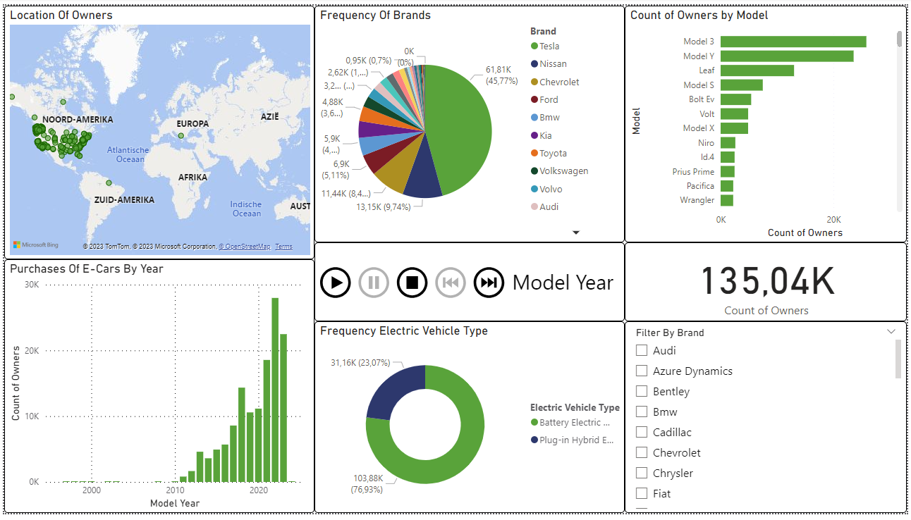
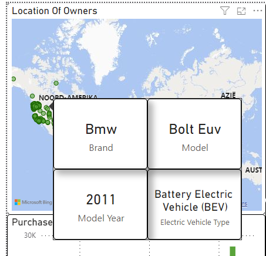
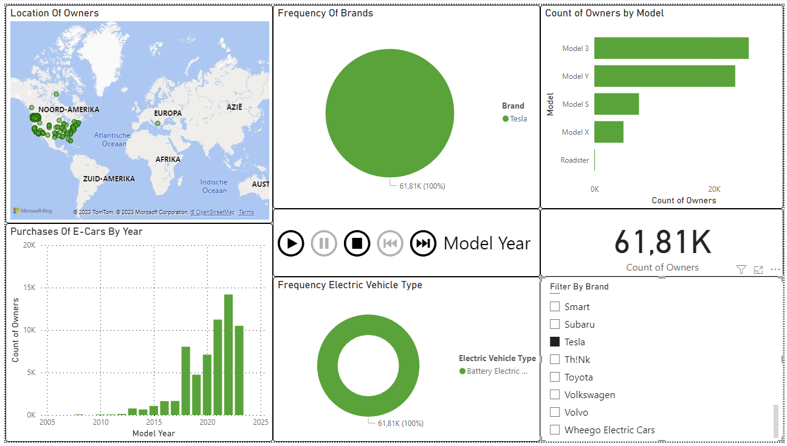

# Electric Vehicles Analysis

## Data Source

The data used in this analysis is from the [Data.gov](https://catalog.data.gov/dataset/electric-vehicle-population-data) website. This dataset contains the Battery Electric Vehicles (BEVs) and Plug-in Hybrid Electric Vehicles (PHEVs) that are currently registered through Washington State Department of Licensing (DOL).

## Images

